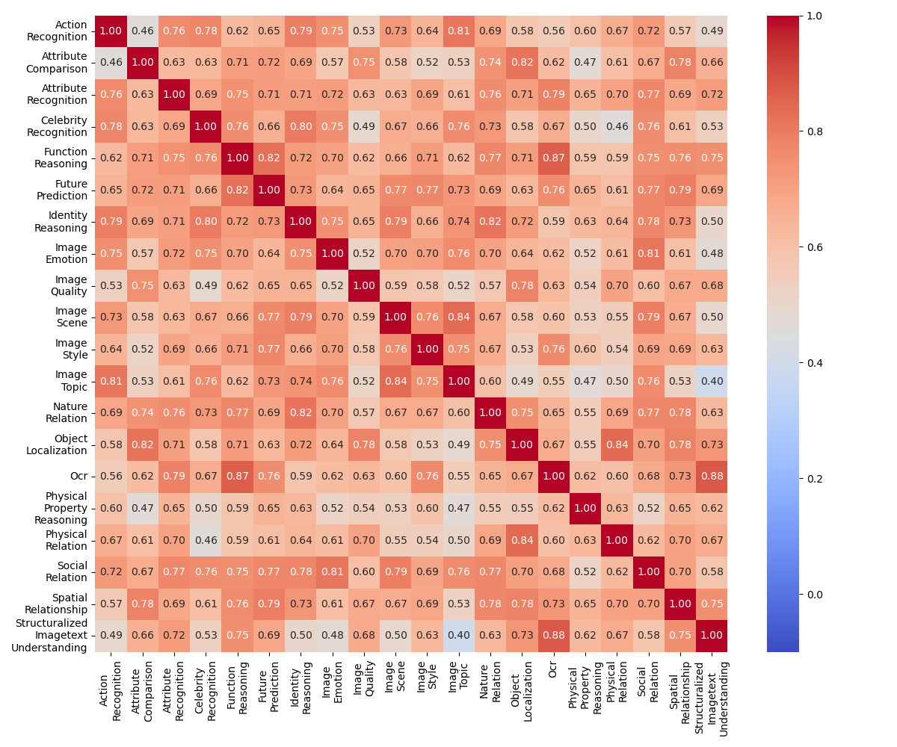

<div align="center">
    
    
 <div>

  
  <h1>Redundancy Principles for MLLMs Benchmarks</h1>
  
_Where Redundancy Exists? and Why Evaluate Redundancy?_

  <div>
      <a href="https://zzc-1998.github.io/" target="_blank">Zicheng Zhang</a><sup>1,2</sup><sup>*</sup>,
      <a href="" target="_blank">Xiangyu Zhao</a><sup>1,2</sup><sup>*</sup>,
      <a href="" target="_blank">Xinyu Fang</a><sup>1,3</sup>,
      <a href="https://github.com/lcysyzxdxc" target="_blank">Chunyi Li</a><sup>1,2</sup>,
      <a href="https://scholar.google.ca/citations?user=Tq2hoMQAAAAJ&hl=en" target="_blank">Xiaohong Liu</a><sup>2</sup>,
  </div>

<div>
     <a href="https://minxiongkuo.github.io/" target="_blank">Xiongkuo Min</a><sup>2</sup>,
     <a href="https://kennymckormick.github.io" target="_blank">Haodong Duan</a><sup>1</sup><sup>#</sup>,
     <a href="https://chenkai.site/" target="_blank">Kai Chen</a><sup>1</sup><sup>#</sup>,
      <a href="https://ee.sjtu.edu.cn/en/FacultyDetail.aspx?id=24&infoid=153&flag=153" target="_blank">Guangtao Zhai</a><sup>1,2</sup><sup>#</sup>
      
  </div>
  <div>
  <sup>1</sup>Shanghai AI Lab, <sup>2</sup>Shanghai Jiaotong University,  <sup>3</sup>Zhejiang University
       </div>   
<div>
<sup>*</sup>Equal contribution. <sup>#</sup>Corresponding authors. 
   </div>
  <a href="https://arxiv.org/abs/2501.13953"><strong>Paper</strong></a> |
 <a href="https://github.com/zzc-1998/Benchmark-Redundancy"><strong>Github</strong></a> 
  <div style="width: 100%; text-align: center; margin:auto;">
      
  </div>
  
<div align="left">
    
The rapid growth of MLLM benchmarks has inevitably led to significant redundancy among benchmarks. 
Therefore, it is crucial to take a step back and critically assess the current state of redundancy and propose targeted principles for constructing effective MLLM benchmarks.
Specifically, we focus on redundancy from three key perspectives:
**1) Redundancy of benchmark capability dimensions**, 
**2) Redundancy in the number of test questions**, 
and **3) Cross-benchmark redundancy within specific domains**.
 


## Redundancy Framework
    
<table>
  <tr>
    <td></td>
    <td style="padding-left: 20px;">
      <h3>Dimensions Redundancy</h3>
      <p>$$\rho(X_i) = \frac{1}{m-1} \sum_{\substack{j=1 \\ j \neq i}}^m \text{CORR}(R_i, R_j),$$ </p>
      <p>where $$\\\text{CORR}(R_i, R_j)$$ is the correlation coefficient between the rankings $$R_i$$ and $$R_j$$. The rankings $$R_i$$ and $$R_j$$ are the performance ranking of MLLMs on i-th and j-th dimensions of the benchmark.</p>
        <hr>
        <h3>Instances Redundancy</h3>
      <p>$$\rho(A\%) = \text{CORR}(R_{A\%}, R_{\text{GT}})$$,</p>
      <p></p> where $$R_{A\%}$$ is the MLLM ranking based on the sampled $$A\%$$ instances, and $$R_{\text{GT}}$$ is the MLLM ranking based on all instances within the MLLM benchmark.
        <hr>
        <h3>Cross-Benchmark Redundancy</h3>
      <p>$$\rho(Y_i) = \frac{1}{l-1} \sum_{\substack{j=1 \\ j \neq i}}^l \text{CORR}(K_i, K_j), $$</p>
    <p>where $$\text{CORR}(K_i, K_j)$$ is the correlation coefficient between the rankings $$K_i$$ and $$K_j$$. The rankings $$R_i$$ and $$R_j$$ are the performance ranking of MLLMs on i-th and j-th benchmarks of the specific domain.</p>
    </td>
  </tr>
</table>

## Redundancy Principles Recommendations

We recommend performing redundancy detection on the benchmark after it is designed and initially tested on some MLLMs. This step ensures that the evaluation results are both more scientifically reliable and more efficient.

**1) Dimensions Redundancy Check**


Calculate the dimensional redundancy of the benchmark, **placing particular emphasis on dimensions with overall high redundancy**. Additionally, analyze the redundancy heatmap to identify pairs of dimensions with exceptionally high redundancy and evaluate whether these dimensions assess similar capabilities.

**2) Instances Redundancy Check**

Compute the instance redundancy curve of the benchmark and assess whether a limited subset of the instances can yield results similar to those of the full instances. If significant instance redundancy is identified, it is essential to **review and reduce the redundant instances**.

**3) Cross-benchmark Redundancy Check**

If you aim to design a benchmark as a representative for a specific vertical domain, calculate the cross-benchmark redundancy within that domain. **Higher redundancy indicates stronger representativeness**.
On the other hand, if your goal is to **identify gaps within a vertical domain, it is better to keep redundancy low to ensure broader coverage**.

If you want to test the core capabilities of a vertical domain under limited resources, it is recommended to select the benchmark with the highest cross-benchmark redundancy within the domain.


# Redundancy Results
<table>
    <h3>1-A Dimensions Redundancy Heatmaps on MMBench</h3>
    <tr>
        <td>
            
            <p>Figure 1: Top-50 SRCC dimensions redundancy map</p>
        </td>
        <td>
            
            <p>Figure 2: Bottom-50 SRCC dimensions redundancy map</p>
        </td>
    </tr>
    <tr>
        <td>
            
            <p>Figure 3: Top-50 PLCC dimensions redundancy map</p>
        </td>
        <td>
            
            <p>Figure 4: Bottom-50 PLCC dimensions redundancy map</p>
        </td>
    </tr>
    <tr>
        <td>
            
            <p>Figure 5: Top-50 R2 dimensions redundancy map</p>
        </td>
        <td>
            
            <p>Figure 6: Bottom-50 R2 dimensions redundancy map</p>
        </td>
    </tr>
</table>

<table>
         <h3>1-B Dimensions Redundancy Bar Plots on MMBench</h3>
        <tr>
            <td>
                
                <p>Figure 7: Top-50 SRCC redundancy</p>
            </td>
            <td>
                
                <p>Figure 8: Top-50 PLCC redundancy</p>
            </td>
            <td>
                
                <p>Figure 9: Top-50 R2 redundancy</p>
            </td>
        </tr>
        <tr>
            <td>
                
                <p>Figure 10: Bottom-50 SRCC redundancy</p>
            </td>
            <td>
                
                <p>Figure 11: Bottom-50 PLCC redundancy</p>
            </td>
            <td>
                
                <p>Figure 12: Bottom-50 R2 redundancy</p>
            </td>
        </tr>
    </table>

1) These figures allow for a quick analysis of which dimensions exhibit high correlations.
2) All Bottom-50 dimensions exhibit significantly higher redundancy than Top-50 redundancy.
   
<table>
        <h3>2 Instances Redundancy Curves</h3>
        <tr>
            <td>
                
                <p>Figure 13: Instances redundancy with Top-50 MLLMs.</p>
            </td>
            <td>
                
                <p>Figure 14: Instances redundancy with Bottom-50 MLLMs.</p>
            </td>
        </tr>
    </table>

1) The majority of current MLLM benchmarks exhibit significant redundancy in their instances to rank both Top-50 and Bottom-50 MLLMs, with at least 50% of instances being redundant.
2) The R² score can be understood as representing the fitness of predicting the final performance of MLLMs based on sampled instances. Compared to ensuring ranking accuracy, achieving high accuracy in predicting the absolute performance of MLLMs typically requires significantly more instances.

## How to Calculate Benchmark Redundancy

We present a sample script [benchmark_dimensions_redundancy.py](https://github.com/zzc-1998/Benchmark-Redundancy/blob/main/utils/benchmark_dimensions_redundancy.py) to quickly do the benchmark dimensions redundancy check from the MLLM results on [OpenCompass](http://opencompass.openxlab.space/assets/OpenVLM.json).

Use the following command to do the Top-50 redundancy check for MMBench
```
python benchmark_dimensions_redundancy.py --input_file opencompass_vlm.json --bench MMBench_TEST_EN_V11 --save_folder results --top_k 50 --vmin -0.1 --vmax 1.0
```
Use the following command to do the Bottom-50 redundancy check for MM-Bench
```
python benchmark_dimensions_redundancy.py --input_file opencompass_vlm.json --bench MMBench_TEST_EN_V11 --save_folder results --top_k 50 --vmin -0.1 --vmax 1.0
```


## Contact

Please contact any of the first authors of this paper for queries.

- Zicheng Zhang, `zzc1998@sjtu.edu.cn`, @zzc-1998


### Citation

If you find our work useful, please cite our paper as

```
@misc{zhang2025redundancyprinciplesmllmsbenchmarks,
      title={Redundancy Principles for MLLMs Benchmarks}, 
      author={Zicheng Zhang and Xiangyu Zhao and Xinyu Fang and Chunyi Li and Xiaohong Liu and Xiongkuo Min and Haodong Duan and Kai Chen and Guangtao Zhai},
      year={2025},
      eprint={2501.13953},
      archivePrefix={arXiv},
      primaryClass={cs.CL},
      url={https://arxiv.org/abs/2501.13953}, 
}
```


